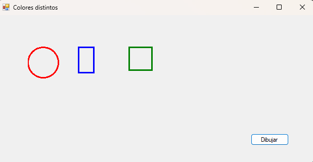
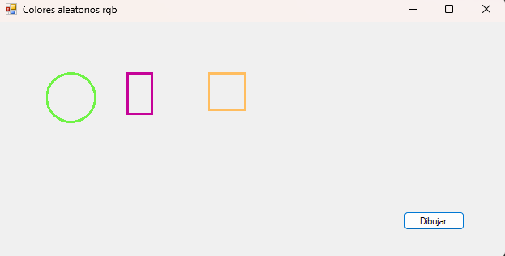
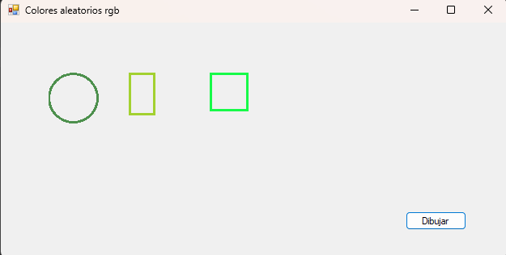
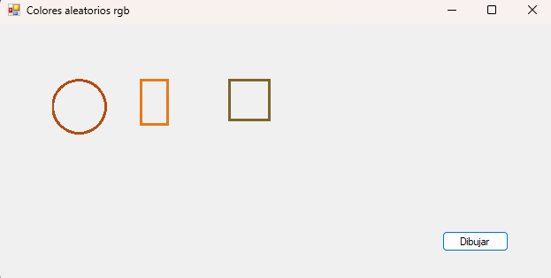
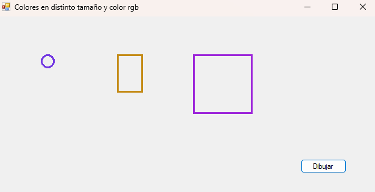
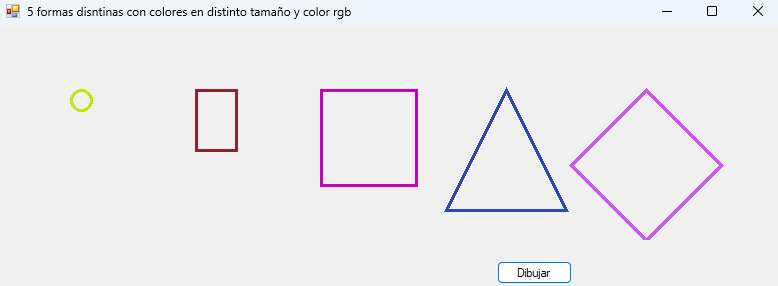
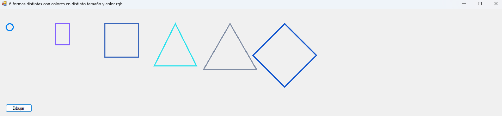

# ExMetodosVirtuales

Trabajo práctico especial de introducción a **C# / .NET / Mono**, basado en un proyecto de ejemplo con **Windows Forms**.  
El objetivo principal es practicar conceptos de programación orientada a objetos como **herencia**, **métodos virtuales**, **sobrescritura de métodos** y **polimorfismo**, aplicados al dibujo de figuras geométricas.

## Tecnologías utilizadas

- C#
- .NET Framework
- Windows Forms
- Mono
- Ubuntu mediante WSL
- Visual Studio Community
- Git / GitHub

## Descripción del proyecto

El programa muestra una ventana con un botón que permite dibujar distintas figuras geométricas, como:

- Círculo
- Rectángulo
- Cuadrado

Cada figura hereda de una clase base `Figura` y redefine el método `Dibujar()`, utilizando métodos virtuales y `override`.

## Vista del proyecto 
## Consigna 2 creando colores distintos

## Consigna 3 - Colores aleatorios RGB

Para cumplir con la consigna 3, los colores de las figuras se generan aleatoriamente utilizando la clase `Random` y el método `Color.FromArgb()`.

Cada vez que se ejecuta el programa, las figuras pueden aparecer con colores diferentes.

### Ejecución 1

### Ejecución 2

### Ejecución 3

## Consigna 4 - Tamaños crecientes

Para cumplir con la consigna 4, las tres figuras se muestran con tamaños proporcionalmente crecientes, vistas de izquierda a derecha.

De esta manera, la primera figura aparece con un tamaño menor, la segunda con un tamaño intermedio y la tercera con un tamaño mayor.

## Consigna 5 - Nuevas figuras

Para cumplir con la consigna 5, se agregaron dos nuevas figuras al modelo de clases: `Triangulo` y `Rombo`.

Ambas clases heredan de `Figura` y redefinen el método `Dibujar()` para poder mostrarse en pantalla. De esta manera, el programa ahora dibuja cinco figuras distintas utilizando polimorfismo.

## Consigna 5 - Nuevas figuras

Para cumplir con la consigna 5, se agregaron dos nuevas figuras al modelo de clases: `TrianguloIsosceles` y `TrianguloEquilatero`.

Inicialmente interpreté que la consigna pedía agregar dos figuras nuevas a elección, por eso había agregado la clase `Rombo`. Luego, al revisar nuevamente el enunciado, corregí el modelo agregando los dos triángulos solicitados.

De todas formas, decidí mantener el `Rombo` como una figura adicional, ya que también hereda de `Figura` y redefine el método `Dibujar()`, respetando el mismo diseño orientado a objetos del proyecto.

Todas las figuras se dibujan utilizando polimorfismo, ya que el arreglo contiene objetos de tipo `Figura`, pero cada clase implementa su propia forma de dibujarse.

En esta ejecución se muestran seis figuras distintas con colores aleatorios RGB y tamaños crecientes.

## Autor

Proyecto realizado con fines educativos.  
Hecho por **Lucas Rimbano**.
